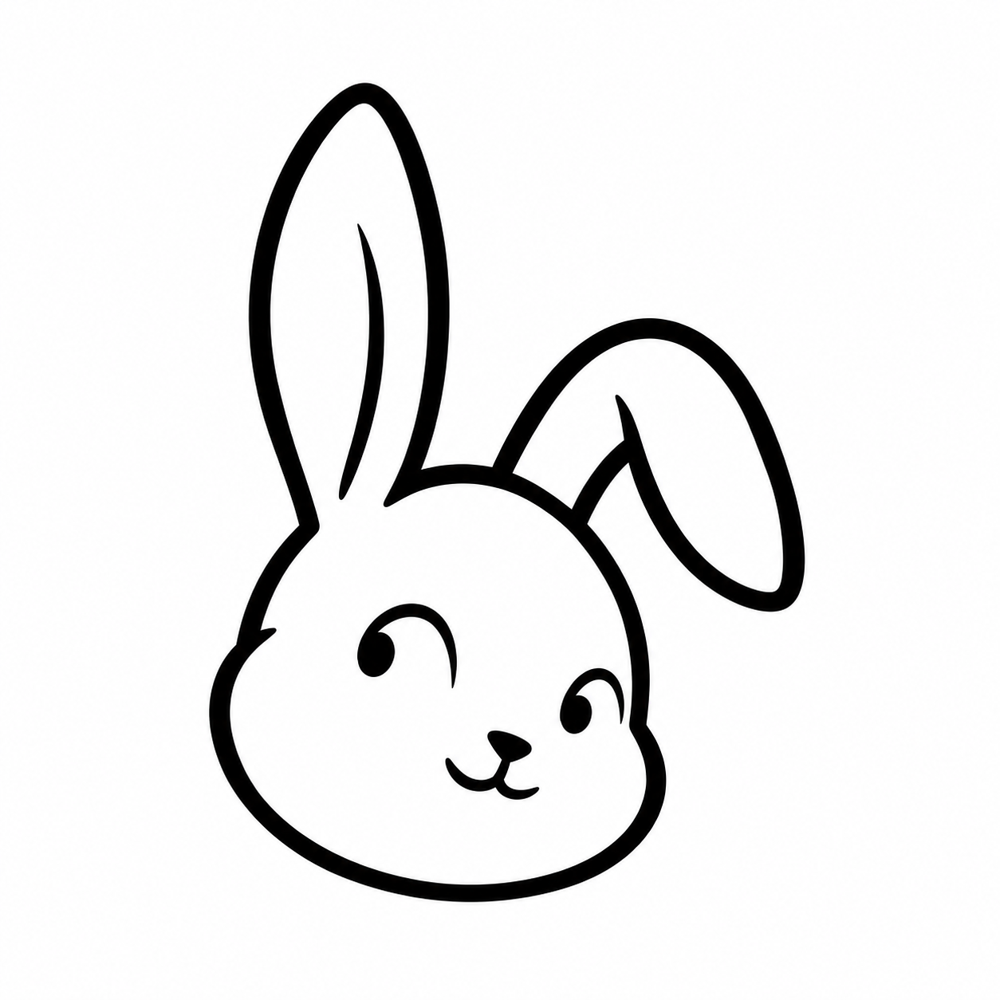

<p align="center">
  
</p>

<h1 align="center">Glimpsely</h1>
<p align="center"><strong>随手发给我，生活小事我帮你记。</strong></p>
<p align="center">微信里的私人记忆助手 · 截图理解 · 随口查询 · 贴心建议</p>

| **简体中文 · 当前** | [English](README.en.md) |
| :---: | :---: |

截图存了一堆，真正要用时却找不到？优惠券收藏了，回过神已经过期？

**Glimpsely 把你的微信聊天窗口变成一个会记事的生活助手。** 把截图、文字或语音发给它，它会整理成可查询的记忆；需要时问一句，就能找回相关信息，还能根据最近的记录生成生活建议。

## 它能怎么帮你？

| 你随手发来的内容 | 它帮你做的事 |
| --- | --- |
| 快递通知、购物小票 | 记下取件码、单号等信息，用时直接问 |
| 优惠券、账单、日程截图 | 提取截止时间，对仍活跃的记录在临期一小时内尝试提醒 |
| 餐厅地址、聊天截图、生活灵感 | 保存内容与图片文字，之后按问题查找 |
| 最近几天积累的记录 | 生成简报，结合具体内容给出建议与启发 |

像跟朋友聊天一样使用，无需学习指令。下面是交互示意，实际回复取决于截图内容和模型：

> **你：** ［发来一张快递截图］<br>
> **Glimpsely：** 已记下 ✓ 顺丰快递，取件码 8-2-3002<br>
> **你：** 刚才那个快递取件码是多少？<br>
> **Glimpsely：** 取件码是 8-2-3002。

也可以说「记一下：今晚八点开会」「给我发份日报」，或者直接发语音。语音功能需额外准备本地识别模型；当前对话与简报以中文为主。

## 为日常记忆而设计

- **看懂再记。** 先识别截图原文，再结合多模态模型理解，支持一条消息里的多张图片。
- **问一句，找回来。** 从记忆库检索相关记录，结合保存的截图文字回答。
- **不只收藏，也给建议。** 简报会参考最近记录，帮你留意待办、优惠和生活习惯；建议来自已存内容，不是实时联网推荐。
- **本地保存、本地推理。** 默认使用本机模型与 SQLite。消息仍经微信传输；如果自行配置远程模型，相关内容会发送到该服务。

## 快速开始

当前面向**单用户、自托管**，需要一台持续运行的电脑，以及可登录机器人、与你聊天的微信账号。现有启动脚本以 macOS + omlx 为基础；建议使用 Python 3.12。

### 1. 安装与配置

下载项目后，在项目根目录执行：

```bash
python3.12 -m venv .venv
source .venv/bin/activate
python -m pip install --upgrade pip
python -m pip install 'wechat-ilink-bot>=0.1.0' 'apscheduler>=3.11' 'httpx>=0.27' 'pillow>=12.0'
python -m pip install -i https://pypi.org/simple 'sherpa-onnx>=1.13' 'pilk>=0.2'
python -m pip install 'sqlite-vec>=0.1' 'paddlepaddle>=3.0' 'paddleocr>=3.7'
cp -n .env.example .env
```

已有 `.env` 时保留原配置。编辑其中的模型服务地址、密钥和模型名：

```dotenv
OMLX_BASE_URL=http://127.0.0.1:8000
OMLX_API_KEY=1234
OMLX_MODEL=Qwen3.5-9B-4bit
```

需自行安装 omlx 并加载对应的视觉语言模型。客户端调用 OpenAI 兼容的 `/v1/chat/completions` 接口；其他服务需自行验证兼容性。`OMLX_BASE_URL` 不要附加 `/v1`。

### 2. 先体验，再接入微信

```bash
# 启动已配置好的本地模型服务
omlx start

# 检查截图理解
python -m glimpsely.main test-llm

# 不登录微信也能体验：截图记录、临期提醒与简报
python -m glimpsely.main demo

# 登录微信并启动助手
python -m glimpsely.main run
```

首次运行按终端提示扫码登录，再从自己的微信向机器人账号发送一张截图。收到「已记下 ✓」后，就可以继续询问或请求简报。Demo 使用独立的 `data/demo.db`，推送只打印到终端。

<details>
<summary>可选：语音、常用配置与开发命令</summary>

语音使用 sherpa-onnx + SenseVoice。准备匹配的 SenseVoice ONNX 模型与词表，放在 `models/sensevoice/model.int8.onnx` 和 `models/sensevoice/tokens.txt`，或通过 `ASR_MODEL`、`ASR_TOKENS` 指定路径。缺少模型时仍可使用文字和图片。PaddleOCR 首次运行可能需要下载识别模型。

| 配置项 | 默认值 | 用途 |
| --- | --- | --- |
| `DIGEST_HOUR` | `21` | 自动简报检查时段，使用电脑本地时间 |
| `MEMORY_TTL_DAYS` | `3` | 记录进入“暂时遗忘”前的天数 |
| `PUSH_LIMIT_PER_HOUR` | `3` | 每小时主动推送上限 |
| `PUSH_DAILY_CAP` | `15` | 每日主动推送上限 |

```bash
python -m glimpsely.main login         # 重新扫码登录
python -m pip install ruff pytest pytest-asyncio
make ci                               # lint + 测试，部分测试依赖本地模型
```

记忆数据库默认位于 `data/glimpsely.db`，媒体位于 `data/media/`，运行日志位于 `data/run.log`。更详细的架构与历史设计见 [DESIGN.md](DESIGN.md)，实际行为以当前代码和下方限制为准。

</details>

## 当前边界

项目仍在早期迭代，适合个人体验和学习：

- **仅用于一个人的记忆库。** 记录尚未按用户隔离，不适合多人共用；当前接入方式仅支持微信一对一聊天。
- **提醒依赖进程在线和微信会话有效。** 会话过期后，发送一条普通消息可触发恢复；识别和提醒可能遗漏，重要事项请核对原文。
- **“遗忘”不等于删除。** 默认超过 3 天的记录停止参与主动提醒，仍保存在本地并可被查询唤醒；当前唤醒逻辑可能重算截止时间。“清空记忆”也不会删除媒体文件、画像和所有索引。
- **自动日报有已知限制。** 当前发送标记未按天重置，首次成功后不会自动每日重复；可发送「给我发份日报」手动获取。`DIGEST_MINUTE` 暂未接入调度。
- **检索仍较轻量。** 当前使用本地字符/词元哈希向量；向量扩展不可用时退回最近记录，复杂语义查询可能找不全。

## 使用协议

采用 [PolyForm Noncommercial 1.0.0](LICENSE)，适合个人使用、学习研究和非商业修改分享：

- 允许协议规定的非商业使用、修改，以及原版或修改版的再分发。
- 再分发时必须附带协议全文或链接，并保留 [NOTICE](NOTICE) 中的原作者署名。
- 本协议不授予商业使用权限；商业使用需另行获得作者授权。
- 协议对非商业机构另有明确许可，具体范围以[官方条款](https://polyformproject.org/licenses/noncommercial/1.0.0)为准；第三方依赖与模型遵循各自协议。

这是**源码可用的非商业项目**，不属于 OSI 定义的开源软件。
